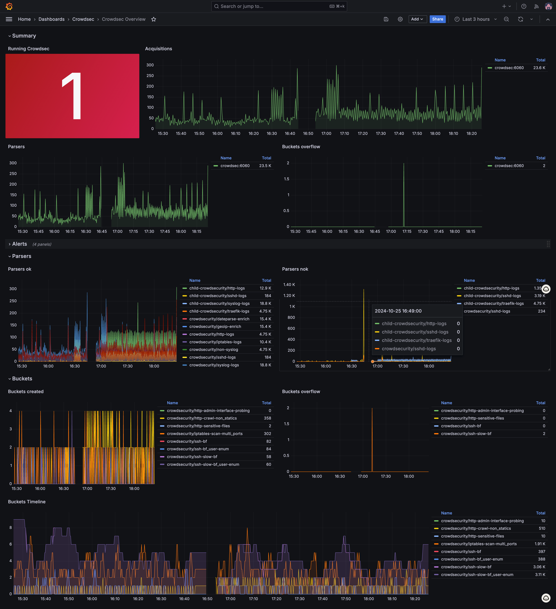

# Firewall with CrowdSec

NewPush Labs offers a pre-configured [CrowdSec](https://www.crowdsec.net/) deployment right out of the box with [Uncomplicated Firewall](https://help.ubuntu.com/community/UFW) (UFW), which includes both a Traefik bouncer and a firewall bouncer for comprehensive security protection.


## Architecture

```mermaid

graph TD

    subgraph SystemLogs["System Logs"]
        direction LR
        SysLogs["auth.log, syslog, kern.log"]
    end
    
    subgraph ApplicationLogs["Application Logs"]
        direction LR
        TFAccessLog["access.log"]
        SysLogs["auth.log, syslog, kern.log"]
    end

    
    subgraph FirewallLogs["Firewall Logs"]
        direction LR
        UFWLog["ufw.log"]
    end

    FirewallLogs -->|crowdsecurity/iptables| CSParser["CrowdSec Parser"]
    ApplicationLogs -->|crowdsecurity/traefik| CSParser["CrowdSec Parser"]
    SystemLogs["System Logs"] -->|crowdsecurity/linux| CSParser["CrowdSec Parser"]
    Blocklists["Blocklists from CrowdSec Hub"]
    Blocklists --> CSDecisions["CrowdSec Decisions"]
    
    subgraph CrowdSec
        direction LR
        CSParser
        CSDecisions
    end
    
    CSParser -->|Processes Logs| CSDecisions

    subgraph Bouncers
        direction TB
        CSFirewallBouncer["CrowdSec-Firewall-Bouncer"]
        CSTraefikBouncer["CrowdSec-Traefik-Bouncer"]
    end

    CSDecisions -->|Manages Rules| CSFirewallBouncer
    CSDecisions -->|Manages Rules| CSTraefikBouncer

    UFW["UFW"]
    Internet[("Internet Traffic")]

    CSFirewallBouncer -->|Applies Rules| UFW
    UFW -->|Deny Incoming by Default| Internet
    
    
```


## Features

NewPush Labs prioritizes security by implementing a robust firewall solution that combines the simplicity of Uncomplicated Firewall (UFW) with the advanced threat detection capabilities of CrowdSec. It comes with Grafana dashboards.




### Uncomplicated Firewall

UFW provides a user-friendly interface for managing iptables, ensuring basic network protection, while CrowdSec offers real-time threat intelligence and collaborative security. This dual-layered approach creates a comprehensive defense mechanism, safeguarding the lab environment against a wide range of potential security threats and unauthorized access attempts.

  - Simple and user-friendly interface for managing iptables
  - Default deny incoming, allow outgoing policy
  - Easy rule creation for allowing/denying specific ports or services
  - Logging capabilities for firewall events

### CrowdSec
  - Real-time threat detection and prevention
  - Collaborative security through shared blocklists
  - Automatic IP reputation management
  - Multi-source log parsing and analysis
  - Customizable scenarios and rules for threat detection
  - Integration with various services (e.g., Traefik, Firewall)
  - API-based architecture for easy integration and extensibility


:::tip

Consider exploring the deployment configuration to enable CAPTCHA functionality within Traefik. 

```yaml
traefik_crowdsec_bouncer: true
hcaptcha_site_key: 
```

:::

## Usage

### UFW Commands

UFW (Uncomplicated Firewall) can be managed using the following common commands:

1. Enable UFW:
   
```bash
sudo ufw enable
```

2. Check UFW status:
```bash
sudo ufw status verbose
```

3. Disable UFW:
```bash
sudo ufw disable
```

4. Allow incoming traffic on a specific port:
```bash
sudo ufw allow <port_number>
```

5. Deny incoming traffic on a specific port:
```bash
sudo ufw deny <port_number>
```

6. Allow incoming traffic from a specific IP address:
```bash
sudo ufw allow from <ip_address>
```

7. Remove a rule:
```bash
sudo ufw delete allow <port_number>
```
or
```bash
sudo ufw delete deny <port_number>
```

8. Reset UFW to default settings:
```bash
sudo ufw reset
```

Remember to use these commands with caution, as improper configuration can lead to unintended consequences for your network security.

### CrowdSec Commands

CrowdSec can be managed using the `cscli` command-line tool. Here are some common commands:

1. Check CrowdSec status:
```bash
docker exec -it crowdsec cscli status
```

2. List active decisions (bans):
```bash
docker exec -it crowdsec cscli decisions list
```

3. Add a ban for an IP:
```bash
docker exec -it crowdsec cscli decisions add --ip <ip_address>
```

4. Remove a ban for an IP:
```bash
docker exec -it crowdsec cscli decisions delete --ip <ip_address>
```

5. Update CrowdSec
```bash
docker exec -it crowdsec cscli hub update
```

6. Metrics 
```bash
docker exec -it crowdsec cscli metrics
```

:::tip

You can remove all decisions with the following command:

```bash
docker exec -it crowdsec cscli decisions delete --all
```

:::

These commands allow you to manage both UFW and CrowdSec effectively, providing comprehensive control over your firewall and threat detection system.

